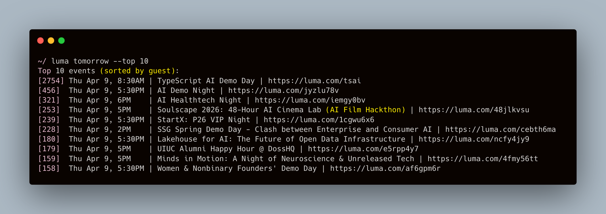

# luma

A CLI tool to query and browse [Luma](https://luma.com) events.



## Install

- Clone and `cd` into the repo
- Run `make setup` and put the venv on your PATH (the command prints where it is)
- Nuclear option: `make clean && make setup`

## Quick start

Start by fetching events: `luma refresh`.

Check what's happening today with `luma`, or look ahead with `luma week`.

Too much noise? Add filters: `luma next-week --day tue,thu --min-time 18`.

Still not finding what you want? Ask in plain English: `luma next-week "AI meetups"` (needs an LLM key in config).

## Commands

Commands:

- `luma` -- show today's popular events
- `luma refresh` -- fetch fresh events from Luma
- `luma query` -- query events with filters
- `luma like` -- like or dislike events interactively
- `luma suggest` -- get personalized event suggestions
- `luma sc` -- run a saved shortcut

Date shortcuts:

- `luma today` -- events for today
- `luma tomorrow` -- events for tomorrow
- `luma week` -- remaining events this week
- `luma weekday` -- remaining weekday events this week
- `luma weekend` -- weekend events this week
- `luma mon` -- events for Monday
- `luma tue` -- events for Tuesday
- `luma wed` -- events for Wednesday
- `luma thu` -- events for Thursday
- `luma fri` -- events for Friday
- `luma sat` -- events for Saturday
- `luma sun` -- events for Sunday

Prefix any date shortcut with `next-` for the following week:

- `luma next-week` -- all events next week
- `luma next-weekday` -- next week's weekday events
- `luma next-weekend` -- next weekend's events
- `luma next-mon`, `luma next-tue`, ... `luma next-sun` -- that day next week

Free-text questions go through the agent (requires an LLM API key in config):

```shell
luma next-week --top 50 "agent infra meetups skip social events"
```

## Configuration

Edit `~/.luma/config.toml` for defaults.

### LLM

```toml
[llm]
provider = "anthropic"

[llm.anthropic]
api_key = "sk-ant-..."
model = "claude-sonnet-4-20250514"

[llm.ollama]
host = "http://localhost:11434"
model = "llama3.1"
```

### Event sources

Configure which Luma category pages and calendars `luma refresh` fetches events from.

```toml
[refresh]
categories = [
  "https://luma.com/ai",
  "https://luma.com/tech",
]

[[refresh.calendars]]
url = "https://luma.com/genai-sf"
calendar_api_id = "cal-JTdFQadEz0AOxyV"

[[refresh.calendars]]
url = "https://luma.com/deepmind"
calendar_api_id = "cal-7Q5A70Bz5Idxopu"
```

`calendar_api_id` is optional; if omitted, `luma refresh` resolves it automatically from the URL during fetch.

### One-off provider

```shell
luma --provider ollama "events this week"
```

## Development

### Tests

```shell
make test
```

### Evals

- `make eval-list` — list datasets
- `make eval-smoke` — one tagged case per dataset
- `make eval SET=query_command/date_parsing` — single dataset
- `make eval-all` — all datasets, in order
- `make eval-all TAG=nature:edge_case` — filter cases by tag
- `make eval SET=query_command/smoke PROVIDER=ollama` — force a provider
- `make eval VERBOSE=1` or `make eval-all VERBOSE=1` — show each assertion

Each dataset can ship a committed `<dataset>.baseline.json` next to the dataset file. `make eval` loads it and prints a diff table.

```shell
make save-baseline SET=query_command/date_parsing
make save-baseline-all
```

Typical loop: `make eval-smoke`, then `make eval SET=<dataset>`, change things, rerun eval, run `make save-baseline SET=<dataset>` when happy, commit the code and the updated `.baseline.json` together.
